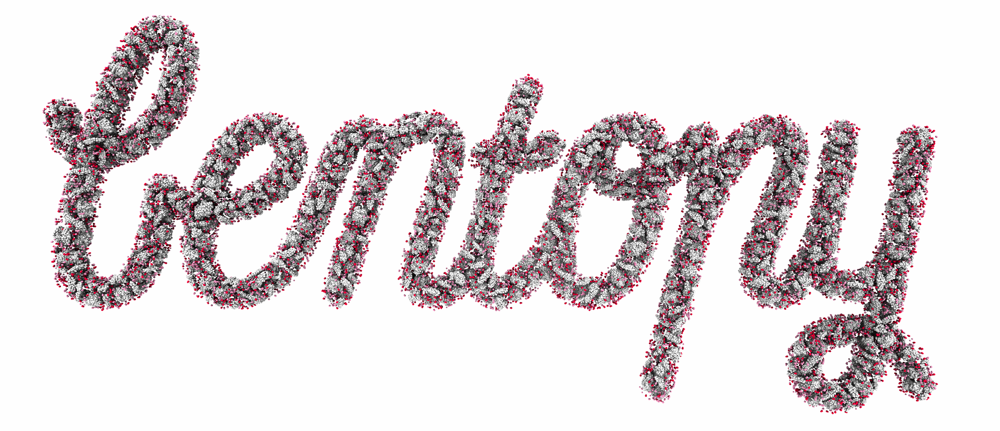

# _bentopy_&mdash;packs stuff in boxes



## State

This project is under development and solely for internal use. Many parts are
in flux, and no guarantees about correctness or stability can be made.

## Installation

### Prerequisites

_bentopy_ is built on a [Rust][rust] core.
A Rust compiler is required during installation. To check whether one is
present, you can run

```console
cargo --version
```

If it is not present, [you can install it][rust-installation] by any means you
prefer. Installation through [_rustup_][rust-rustup] is very convenient.

### Install _bentopy_ through _pip_ directly

If you don't care about peeking into the sources and just want access to the
program, this is the quickest option.

```console
pip3 install git+https://github.com/marrink-lab/bentopy
```

### From source

```console
git clone https://github.com/marrink-lab/bentopy
cd bentopy
python3 -m venv venv && source venv/bin/activate # Not required, but often convenient.
pip3 install .
```

## Usage

_bentopy_ currently features four subcommands,
[_pack_](#pack),
[_render_](#render),
[_mask_](#mask), and
[_grocat_](#grocat).

You can learn about the available options through the help information.

```console
bentopy-pack --help
bentopy-mask --help
...
```

> [!NOTE] For the moment, the bentopy subcommands can be accessed through the
> `bentopy-<subcommand>` pattern. For example, `bentopy-pack`.
> Shortly, a `bentopy` root command will be introduced, which provides access
> through a `bentopy <subcommand>` pattern, e.g., `bentopy pack`.
> Throughout this document, the former usage is shown.
> For now, a dash between the words is necessary.

A typical _bentopy_ workflow may look like this.

```
bentopy-grocat -> bentopy-mask -> bentopy-pack -> bentopy-render -> bentopy-grocat
```

What follows is a brief explanation and example invocation of these
subcommands. A more detailed walkthrough can be found in the
[example](#example) section.

### _pack_

_pack_ provides the core functionality of _bentopy_. Given an input
configuration file, a packing of the input structures within the specified
space is created.

```console
bentopy-pack --rearrange --seed 5172 input.json placements.json
```

_Pack a system defined in `input.json` and write the output placement list to
`placements.json`. Prior to packing, rearrange the specified structures
according to a size heuristic to improve the possible density and set the
random seed to 5172._

### _render_

This packing is stored as a **placement list**, which is a `json` file that
describes _which structures_ at _what rotations_ are _placed where_. In order
to create a structure file (and topology file) from this placement list, the
_render_ subcommand can be used.

```console
bentopy-render placements.json structure.gro -t topol.top
```

_Render `placements.json` created by _pack_ to a `gro` file at `structure.gro`
and write a topology file to `topol.top`._

### _mask_

To set up a configuration for _pack_, you must define a space into which the
structures will be packed. This space can be defined according to an analytical
function, such as a sphere. But, more interestingly, _bentopy_ is capable of
packing arbitrary spaces. These spaces can be provided as voxel masks. Any
boolean numpy array [stored as a compressed file (`.npz`)][numpy-npz] of the
correct dimensions can function as a valid mask.

The _mask_ subcommand provides a convenient and powerful means of setting up
such masks based on your existing structures, right from the command line.
_mask_ can be used to automatically or manually select different compartments
as determined by [mdvcontainment][mdvc].

```console
bentopy-mask chrom_mem.gro mask.npz --autofill
```

_Determine the compartments in `chrom_mem.gro` and automatically select the
innermost compartment (`--autofill`). From that selected compartment, write a
mask to `mask.npz`._

### _grocat_

As the name suggests, _grocat_ is a tool for concatenating `gro` files. Though
this is a relatively simple operation, _grocat_ provides a convenient way of
telling apart different sections of large models by optionally specifying a new
residue name for a whole file in the argument list by appending
`:<residue name>` to a file path.

```console
bentopy-grocat chromosome.gro:CHROM membrane.gro:MEM -o chrom_mem.gro
```

_Concatenate `chromosome.gro` and `membrane.gro` into `chrom_mem.gro`, setting
the residue names of the chromosome atoms to `CHROM` and those of the membrane
to `MEM` in the concatenated structure._

## Example

<!--- TODO: Write an example that is based on a masked space. That would be a
much better representation of what makes bentopy cool. --->

Let's try to pack a spherical system full of lysozyme structures.
First, we want a structure to pack, so we can download the structure for
[`3LYZ`][3lyz]. We place it in a `structures` directory to stay organized.

```console
wget https://files.rcsb.org/download/3lyz.pdb
mkdir structures
mv 3lyz.pdb structures
```

### Input configuration

Now we can set up our input configuration, which we will call
`3lyz_input.json`:

```json
{
	"space": {
		"size": [100, 100, 100],
		"resolution": 0.5,
		"compartments": [
			{
				"id": "main",
				"shape": "spherical"
			}
		]
	},
	"output": {
		"title": "3lyz",
		"topol_includes": [
			"forcefields/forcefield.itp",
			"structures/3lyz.itp"
		]
	},
	"segments": [
		{
			"name": "3lyz",
			"number": 6500,
			"path": "structures/3lyz.pdb",
			"compartments": ["main"]
		}
	]
}
```

#### Space

We set the **space** up to a **size** of 100&times;100&times;100 nm&sup3;, with
a **resolution** of 0.5 nm. The mask&mdash;the volume that defines where
structures can be placed&mdash;is set to be derived from a **spherical**
analytical function.

In case you want to use a custom mask like you may set up with _bentopy-mask_,
you could specify the space in the following manner.

```diff
      	"compartments": [
      		{
      			"id": "main",
-     			"shape": "spherical"
+      			"voxels": { "path": "mask.npz" }
      		}
      	]
```

Here, **voxels** and the associated **path** point to a precomputed voxel mask.
This mask can be any data that can be loaded by [`np.load()`][np-load] to be
interpreted as a three-dimensional boolean mask. The provided mask must have
the same size as specified in the **space** section's **dimensions** divided by
the **resolution**.

#### Output

In **output** we set a **title** for the system, and the optional field
**topol_includes**, we can specify what [`itp` files][gromacs-itp] files are to
be included if the placement list produced from this config is written to a
topology file ([`.top`][gromacs-top]).

> [!NOTE]
> For this example, we filled this field with dummy paths.

#### Segments

Finally, in the **segments** section, we define a list of structures to place.
In our case that is only one: which we give the **name** "3lyz", and we set the
**number** of segments to place to 6500. Instead of a number, a
**concentration** in mol/L for can be provided as well. The volume over which
that concentration applies is that of the segment's associated compartments.
The **path** points _pack_ to where the structure file for this segment can be
found.

> [!IMPORTANT]
> The **name** record must be selected carefully. If you want to write out a
> valid topology file using _bentopy-render_, the value of **name** must
> correspond to the names in the `itp` files.

<details>
<summary>Constraining segment rotations.</summary>

For some systems, it can be helpful or necessary to constrain the rotation
of certain segments. The **rotation_axes** parameter takes a string with the
axes over which a structure may be randomly rotated. Over axes that are not
mentioned, no random rotation will be applied. For instance, the axes
definition `"xyz"` indicates full rotational freedom and is the tacit default
(rotation is allowed over _x_, _y_, and _z_ axes), while `"z"` constrains the
rotation such that it may only occur over the _z_-axis, leaving _x_ and _z_
rotation as provided in the structure file.

Additionally, one can set an **initial_rotation** for a segment.
It can be set in an axis-angle (degrees) `[xangle, yangle, zangle]` list, where
the rotations are applied in _x_, _y_, _z_ order.
This rotation will be applied to the structure as it is loaded from its file
and serves as the starting point for any subsequent rotations. The initial
rotation and constraining of the rotation axes as described above work together
to provide open-ended control of the possible rotations for segments.

```json
		{
			"name": "1a0s",
			"number": 100,
			"path": "structures/1a0s.pdb",
			"initial_rotation": [0, 90, 0],
			"rotation_axes": "x",
			"compartments": ["flat"]
		}
```

With the above segment definition, up to a 100 instances of some structure will
be placed according to some compartment with the id "flat". The structure will
be rotated 90 degrees over its _y_-axis. Random rotations are applied only over
its (post-initial rotation) _x_-axis.

This snippet thus allows placement of that structure over a _yz_ plane,
rotating over the axis that is perpendicular to that plane (_x_-axis).

</details>

### _pack_

Now, we are ready to pack the system. We could simply do this as follows.

```console
bentopy-pack 3lyz_input.json 3lyz_placements.json
```

In order to make the procedure deterministic, the `--seed` parameter can be
set. This means that the same command will produce the same output between
runs.

```console
bentopy-pack --seed 1312 3lyz_input.json 3lyz_placements.json
```

In case we want to pack multiple structures, we may want to pass the
`--rearrange` flag, as well. This will re-order the structures such that large
structures are placed first, and small structures are placed last. This
placement heuristic can lead to denser packings. When it is not set, the order
of the structures in the input configuration is respected.

After the command finishes, we will find that `3lyz_placements.json` has
been created. This is a single-line `json` file, which can be hard to inspect.
If you are curious, you can use a tool such as [`jq`][jq] to look at what was
written in a more readable form.

```console
jq . 3lyz_placement.json
```

<details>
<summary>
The output may look like this (some lines have been cut and adjusted for
legibility).
</summary>

<!--- TODO: This is not strictly an incorrect placement list, but since the
rewrite n_rotations == n_placements, while here n_rotations < n_placements.
--->

```
{
	"title": "3lyz",
	"size": [ 100, 100, 100 ],
	"topol_includes": [ ... ],
	"placements": [
		{
			"name": "3lyz",
			"path": "structures/3lyz.pdb",
			"batches": [
				[
					[
						[ 1.0, 0.0, 0.0 ],
                        [ 0.0, 1.0, 0.0 ],
                        [ 0.0, 0.0, 1.0 ]
					],
					[
						[  8, 46, 68 ],
						[ 26, 62, 88 ],
                        ... many many more of such lines ...
                    ]
                ],
				[
					[
						[   0.3658391780537972, -0.3882572475566672, -0.8458238619952991  ],
						[  -0.8851693094147572, -0.4258733932991502, -0.18736901171236636 ],
						[ -0.28746650147647396,  0.8172442490465064, -0.49947457185455224 ]
					],
					[
						[ 31, 41, 56 ],
						[ 61, 53,  4 ],
                        ... many many more of such lines ...
                    ]
                ]
                ... and on and on and on ...
            ]
        }
    ]
}
```
</details>

### _render_

_render_ reads in the placement list and writes out a [`gro` file][gromacs-gro]
(and optionally, a [`top` topology file][top]). This is a separate operation,
since the packed systems can become very large. Storing the placement list as
an intermediate product decouples the hard task of packing from the simple work
of writing it into a structure file.

We want to render out the placement list we just created into a structure file
called `3lyz_sphere.gro`. Additionally, we would like to produce topology file
(`topol.top`) that Gromacs uses to understand how the structure file is built
up.

```console
bentopy-render 3lyz_placements.json 3lyz_sphere.gro -t topol.top
```

You can now inspect the `3lyz_sphere.gro` structure in a molecular
visualization program of your preference.

But beware! We just created big structure, and some programs may have a hard
time keeping up.

<details>
<summary>
Luckily, _bentopy-render_ has some additional tricks up its sleeve to ease this
load.
</summary>

In case you want to inspect only a small part of a very large placement list,
the `--limits` option allows you to select a cuboid within the volume defined
by the placement list from which the placed structures will be rendered. The
volume that is cut out is defined by a sequence of six comma-separated values
in the order `minx,maxx,miny,maxy,minz,maxz`. If a value is a number, it is
interpreted as a dimension in nm. If it is not a number (the phrase 'none' is
conventional) no limits are set on that dimension.

For example, to only render a 10&times;10&times;10 nm cube extending
from the point (40, 40, 40) to (50, 50, 50), we can pass the following limits.

```console
bentopy-render 3lyz_placements.json 3lyz_small_cube.gro --limits 40,50,40,50,40,50
```

Perhaps we would like to see a pancake instead! To do this, we can define the
limits only for the _z_-direction.

```console
bentopy-render 3lyz_placements.json 3lyz_pancake.gro --limits none,none,none,none,45,55
```

Using `--limits`, we can cut out a part of the packed structure, but perhaps
you want to inspect the total structure without loading as many atoms.

For this, you can try the `--mode` option, which gives you the ability to only
render out certain atoms (`backbone`, `alpha` carbon) or beads (representing
each `residue`, or even only one per structure `instance`). By default, the
mode is `full`, and we have just seen its output. Let's try `alpha`, now.

```console
bentopy-render output/3lyz_placements.json 3lyz_alpha.gro --mode alpha
```

Now, we can compare the sizes of the files.

```console
wc -l 3lyz_sphere.gro 3lyz_alpha.gro
```

Reducing the number of atoms that are rendered out can improve the time it
takes to inspect a packing, if necessary.

> [!NOTE]
> Using modes other than `full` (the default) is obviously not relevant beyond
> inspection and analysis of the packed structure. To reflect this, the option
> to write a topology file and setting a mode are mutually exclusive.

The residue numbers can be assigned to the atoms in the output structure file in two ways. This behavior can be set using the `--resnum-mode` option.

- `--resnum-mode instance`: each instance of a segment will have its own
residue number. The first instance that is placed will have a residue number of
1, the second is 2, etc.
- `--resnum-mode segment`: all instances of a segment will have the same
residue number. The whole group of placed structures for a segment can be
selected by its associated group residue number. In a system with a hundred
instances of two segments each, the hundred structures for the first segment
can be selected with residue number 1, the hundred structures for the second
segment with residue number 2.

In case you want to render out a structure based on a placement list that you
or a colleague have created in a different environment, it can be useful to
direct _render_ to read the input structures from a different directory. To do
this, you can set a root path for the structures with the `--root` option. This
path will be prepended to any relative structure path that is defined in the
placement list.

</details>

[rust]: https://rust-lang.org/
[rust-installation]: https://www.rust-lang.org/learn/get-started
[rust-rustup]: https://rustup.rs/
[numpy-npz]: https://numpy.org/doc/stable/reference/generated/numpy.savez.html
[mdvc]: https://github.com/BartBruininks/mdvcontainment
[gromacs-gro]: https://manual.gromacs.org/current/reference-manual/file-formats.html#gro
[gromacs-top]: https://manual.gromacs.org/current/reference-manual/file-formats.html#top
[gromacs-itp]: https://manual.gromacs.org/current/reference-manual/file-formats.html#itp
[3lyz]: https://www.rcsb.org/structure/3LYZ
[jq]: https://github.com/jqlang/jq
[np-load]: https://numpy.org/doc/stable/reference/generated/numpy.load.html
