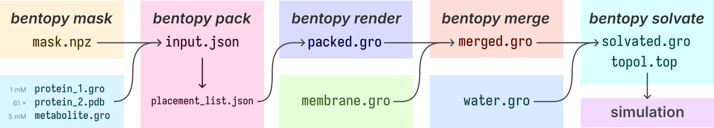

# _bentopy_&mdash;packs stuff in boxes


Build packed models for molecular dynamics simulations, from simple and small
boxes to complex and large mesoscale models.

Bentopy provides tools for determining masks for molecule placement, packing of
complex models, and very fast solvation and ion placement.

These tools are force-field agnostic and can be integrated into molecular
dynamics pipelines for different simulation packages. Bentopy has been used to
help build systems ranging from entire cell models in the Martini force field
to atomistic aerosols.

## Information

A number of resources explaining how to build systems using bentopy are
available.

- The [_bentopy_ wiki][wiki] gives in-depth descriptions of different commands
  and concepts.
	- This includes [Examples][wiki-examples] of how different _bentopy_
	  tools can be used to construct simple and more sophisticated systems.
- Martini Workshop 2025: [Bentopy: from simple packing to building cellular
  models][workshop], an in-depth tutorial. (Note that its current state is
  outdated, and relies on _bentopy_ v0.1.0. An updated tutorial is in progress
  and will soon be published.)

[wiki]: https://github.com/marrink-lab/bentopy/wiki
[wiki-examples]: https://github.com/marrink-lab/bentopy/wiki/examples
[workshop]: https://cgmartini.nl/docs/tutorials/Martini3/Bentopy

## Citation

If you use bentopy to set up your molecular dynamics system in a publication, please cite our work.

<!-- TODO: Apa style citation with doi link. -->

> Westendorp, M.S.S, Stevens, J.A. et al. Bentopy: building molecular dynamics simulations with cellular complexity and scale. _In preparation._

<!-- TODO: Fill when paper is going to print.

```
@article{...}
```

-->

## Installation

_Bentopy_ can be installed through `pip`.

```console
pip install bentopy
```

For most Linux platforms, pre-built binaries are available and will be
installed automatically through `pip`. For other platforms, such as macOS, a
Rust compiler is required. See the [detailed installation
instructions](#detailed-installation-instructions) below.

## Usage

_Bentopy_ currently features five subcommands:

- [_init_](#init): Initialize and check bentopy input files or convert legacy input files.
- [_mask_](#mask): Create masks based on voxel containments.
- [_pack_](#pack): Pack a space and produce a placement list.
- [_render_](#render): Write a structure file and topology based on a placement list.
- [_solvate_](#solvate): Solvate large models, including very fast ion substitution.
- [_merge_](#merge): Merge structure files.

You can learn about the available options through the help information.

```console
bentopy-pack --help
bentopy-mask --help
...
```

A typical _bentopy_ workflow may look like this.



What follows is a brief explanation and example invocation of these
subcommands. A more detailed walkthrough can be found in the
[example](#example) section.

### _pack_

The _pack_ subcommand provides the core functionality of _bentopy_. Given an
input configuration file, the input structures will be packed and their
positions and orientations are written to a **placement list**.

```console
bentopy-pack input.bent placements.json
```

The placement list can be converted to a structure and associated topology
using [_render_](#render).

### _init_

The _init_ subcommand serves to make setting up a new _bentopy_ project easy.
It can be used to create an [example configuration file][example] with
placeholder values, to validate input files, or convert legacy input files into
the `bent` format.

[example]: https://github.com/marrink-lab/bentopy/blob/main/src/init/example.bent

```console
bentopy-init example -o input.bent
```

Read more about the [_init_ command](https://github.com/marrink-lab/bentopy/wiki/bentopy-init).

### _render_

The result of the packing process is stored as a **placement list**, which is a
`json` file that describes _which structures_ at _what rotations_ are _placed
where_. In order to create a structure file (and topology file) from this
placement list, the _render_ subcommand can be used.

```console
bentopy-render placements.json structure.gro -t topol.top
```

_Render `placements.json` created by _pack_ to a `gro` file at `structure.gro`
and write a topology file to `topol.top`._

This is a separate operation from _packing_, since the packed systems can
become very large. Storing the placement list as an intermediate result
decouples the hard task of packing from the simple work of writing it into a
structure file.

### _mask_

In the packing configuration, you can define spaces in terms of basic
analytical shapes. However, many sophisticated modeling tasks require placing
molecules within existing structures, such as vesicles, or membrane shapes
derived from experimental information. Handling such arbitrary shapes is a
first-class part of the _bentopy_ workflow. 

Any boolean numpy array [stored as a compressed file (`.npz`)][numpy-npz] of
the correct dimensions can function as a valid mask.

The _mask_ subcommand is a convenient and powerful tool for deriving such space
masks from point clouds and existing molecular structures. It is built on top
of a versatile library for segmenting point clouds and molecular structures,
called [mdvcontainment][mdvc].

```console
bentopy-mask membrane.gro masks/inside.npz --autofill
```

_Determine the compartments contained by the structure in `membrane.gro` and
automatically select the innermost compartment (`--autofill`). From that
selected compartment, write a mask to `masks/inside.npz`._

The masks created with `bentopy-mask` can be imported as a compartment in a
`bent` file.

```ini
[ compartment ]
inside from "masks/inside.npz"
```

### _merge_

As the name suggests, _merge_ is a tool for concatenating `gro` files. Though
this is a relatively simple operation, _merge_ provides a convenient way of
telling apart different sections of large models by optionally specifying a new
residue name for a whole file in the argument list by appending
`:<residue name>` to a file path.

```console
bentopy-merge chromosome.gro:CHROM membrane.gro:MEM -o chrom_mem.gro
```

_Concatenate `chromosome.gro` and `membrane.gro` into `chrom_mem.gro`, setting
the residue names of the chromosome atoms to `CHROM` and those of the membrane
to `MEM` in the concatenated structure._

### _solvate_

With _solvate_, large boxes can be solvated quickly and conveniently, with
one-step ion substitutions. _Solvate_ is designed to run very fast while having
a low memory footprint, which makes it an excellent tool for general-purpose
solvation for large molecular dynamics simulations. Both atomistic and
coarse-grained water placement is supported!

```console
bentopy-solvate -i packed.gro -o solvated.gro \
	-s NA:0.15M -s CL:0.15M --charge 5172 \
	--water-type tip3p
```

_Solvate the structure in `packed.gro` and output the result to `solvated.gro`.
Substitute water residues for ions at 0.15M NaCl. Compensate the charge of
`packed.gro` with 5172 additional Cl substitutions. Use Tip3P waters
(atomistic)._

A thorough description of the command is [provided in the `bentopy-solvate`
README](src/solvate/README.md).

## Detailed installation instructions

If pre-built binaries are not available for your platform, you need access to
`cargo`. First, you can check if Rust's build system `cargo` is installed.

```console
cargo --version
```

If it is not present, [you can install it][rust-installation] by any means you
prefer. Installation through [_rustup_][rust-rustup] is very easy!

Once `cargo` is installed, installing _bentopy_ using `pip` should work.

### Install from source

Installing bentopy from source gives you access to the very latest changes.
Though the main branch of this project is generally stable, installation from
releases is recommended.

To install _bentopy_ from source, you need access to cargo, as described
earlier. You can use `pip` directly to install the project right from the
repository.

```console
pip install git+https://github.com/marrink-lab/bentopy
```

Alternatively, you can clone the repository somewhere, and build from there.

```console
git clone https://github.com/marrink-lab/bentopy
cd bentopy
pip install .
```

## License

> Copyright 2024 Marieke S.S. Westendorp, Jan A. Stevens
> 
> Licensed under the Apache License, Version 2.0 (the "License");
> you may not use this file except in compliance with the License.
> You may obtain a copy of the License at
> 
> <http://www.apache.org/licenses/LICENSE-2.0>
> 
> Unless required by applicable law or agreed to in writing, software
> distributed under the License is distributed on an "AS IS" BASIS,
> WITHOUT WARRANTIES OR CONDITIONS OF ANY KIND, either express or implied.
> See the License for the specific language governing permissions and
> limitations under the License.

[rust]: https://rust-lang.org/
[rust-installation]: https://www.rust-lang.org/learn/get-started
[rust-rustup]: https://rustup.rs/
[numpy-npz]: https://numpy.org/doc/stable/reference/generated/numpy.savez.html
[mdvc]: https://github.com/BartBruininks/mdvcontainment
[gromacs-gro]: https://manual.gromacs.org/current/reference-manual/file-formats.html#gro
[gromacs-top]: https://manual.gromacs.org/current/reference-manual/file-formats.html#top
[gromacs-itp]: https://manual.gromacs.org/current/reference-manual/file-formats.html#itp
[3lyz]: https://www.rcsb.org/structure/3LYZ
[1ubq]: https://www.rcsb.org/structure/1UBQ
[jq]: https://github.com/jqlang/jq
[np-load]: https://numpy.org/doc/stable/reference/generated/numpy.load.html
